# CMSC129 Lab 4 - Notes App

## App Description
A simple Notes Application that allows students to manage their personal notes. 
The application supports creating, reading, updating, and deleting notes (CRUD). 
It focuses on simplicity and strict Test-Driven Development (TDD).

## User Stories
1. **As a student, I want to create notes, so that I can save important information.**
2. **As a student, I want to edit notes, so that I can correct or update information later.**
3. **As a student, I want to delete notes, so that I can remove unnecessary information.**

## Tech Stack
* **Frontend:** React + Vite
* **Backend:** Express
* **Testing:** 
  * Unit: Jest
  * Integration: Jest + Supertest
  * System/E2E: Playwright
* **Storage:** In-memory array

## Testing Strategy
We are following a strict Red-Green-Refactor TDD cycle. The testing approach is structured into three levels:
1. **Unit Tests (3 minimum):** Pure logic functions (e.g., `validateNoteTitle()`, `validateNoteContent()`, `generateNoteId()`). Tested with Jest.
2. **Integration Tests (2 minimum):** Testing the HTTP request-response cycle for the note API routes (e.g., `POST /notes`, `GET /notes`). Tested with Jest + Supertest.
3. **System Tests (3 minimum):** Testing the complete user stories simulating actual browser behavior. Tested with Playwright.

## Setup Outline
### Prerequisites
- Node.js installed

### Installation & Running Locally
1. Clone the repository.
2. Navigate to the server directory: `cd server`
3. Install backend dependencies: `npm install`
4. Start the backend: `npm start`
5. Navigate to the client directory: `cd ../client`
6. Install frontend dependencies: `npm install`
7. Start the frontend: `npm run dev`

### Running Tests
- **Unit Tests:** `cd server && npm run test:unit`
- **Integration Tests:** `cd server && npm run test:integration`
- **System Tests:** `cd client && npx playwright test`

## Test Results

### Unit Tests (Phase 1)

#### Commit 1

#### Commit 2

#### Commit 3

#### Commit 4
[DOCS UPDATE]

### Integration Tests (Phase 2)

#### Commit 5
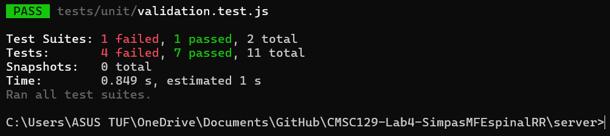
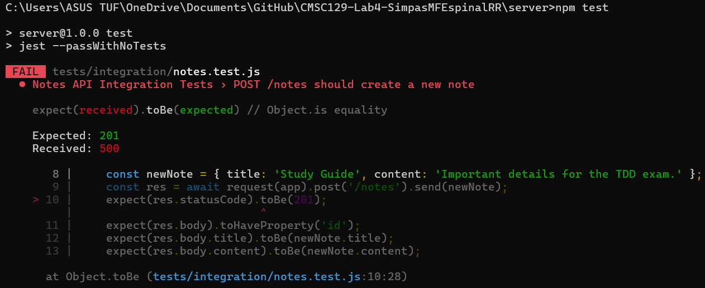
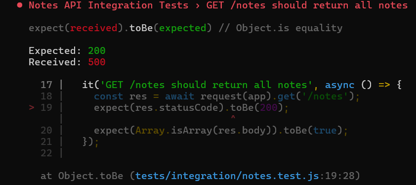
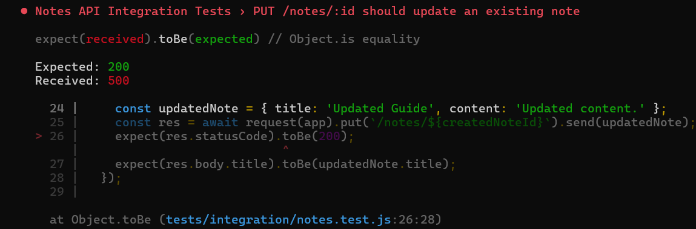
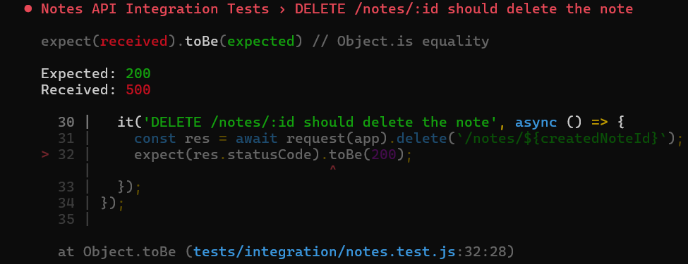

#### Commit 6
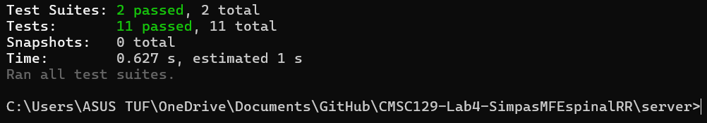
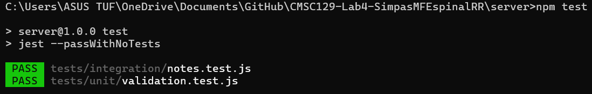

#### Commit 7
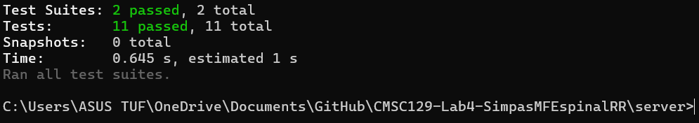
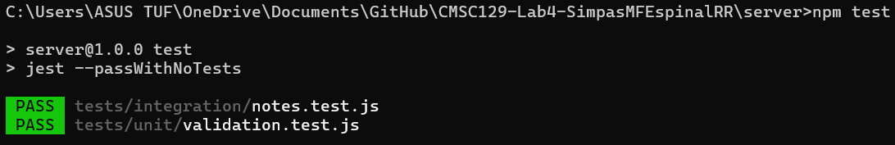

#### Commit 8
[DOCS UPDATE]

### System Tests (Phase 3)

#### Commit 9
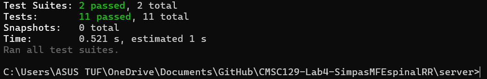
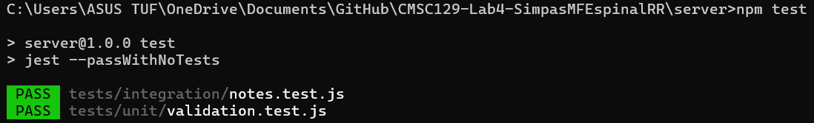

#### Commit 10
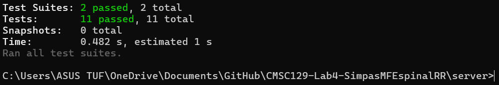
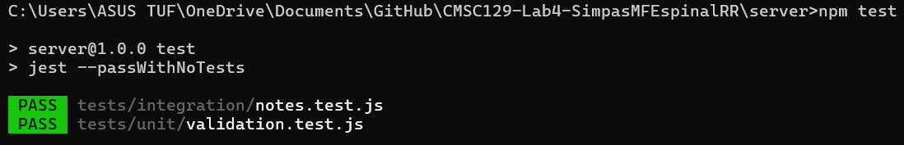

#### Commit 11
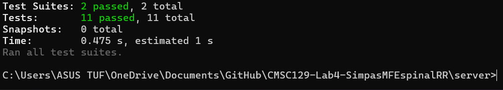
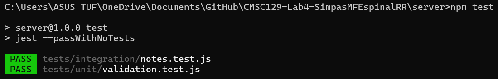

#### Commit 12
[DOCS UPDATE]

## Reflection

This lab reinforced how Test-Driven Development provides a disciplined and structured approach to building software. By writing tests first, we were forced to think carefully about the expected behavior of each function and endpoint before writing any implementation code. The Red-Green-Refactor cycle kept us focused: write a failing test, implement the minimum code to pass it, then clean up without changing behavior.

One of the biggest takeaways was understanding how different testing levels complement each other. Unit tests validated our pure logic functions in isolation, integration tests verified the full HTTP request-response cycle of our API, and system tests with Playwright confirmed that the entire application worked from the user's perspective in a real browser.

The strict commit discipline also taught us the importance of small, incremental changes and maintaining a clean, traceable history that clearly demonstrates the TDD process.
