# CMSC129 Lab 4 - Notes App

## App Description
A simple Notes Application that allows students to manage their personal notes. 
The application supports creating, reading, updating, and deleting notes (CRUD). 
It focuses on simplicity and strict Test-Driven Development (TDD).

## User Stories
1. **As a student, I want to create notes, so that I can save important information.**
2. **As a student, I want to edit notes, so that I can correct or update information later.**
3. **As a student, I want to delete notes, so that I can remove unnecessary information.**

## Tech Stack
* **Frontend:** React + Vite
* **Backend:** Express
* **Testing:** 
  * Unit: Jest
  * Integration: Jest + Supertest
  * System/E2E: Playwright
* **Storage:** In-memory array

## Testing Strategy
We are following a strict Red-Green-Refactor TDD cycle. The testing approach is structured into three levels:
1. **Unit Tests (3 minimum):** Pure logic functions (e.g., `validateNoteTitle()`, `validateNoteContent()`, `generateNoteId()`). Tested with Jest.
2. **Integration Tests (2 minimum):** Testing the HTTP request-response cycle for the note API routes (e.g., `POST /notes`, `GET /notes`). Tested with Jest + Supertest.
3. **System Tests (3 minimum):** Testing the complete user stories simulating actual browser behavior. Tested with Playwright.

## Setup Outline
### Prerequisites
- Node.js installed

### Installation & Running Locally
1. Clone the repository.
2. Navigate to the server directory: `cd server`
3. Install backend dependencies: `npm install`
4. Start the backend: `npm start`
5. Navigate to the client directory: `cd ../client`
6. Install frontend dependencies: `npm install`
7. Start the frontend: `npm run dev`

### Running Tests
- **Unit Tests:** `cd server && npm run test:unit`
- **Integration Tests:** `cd server && npm run test:integration`
- **System Tests:** `cd client && npx playwright test`

## Test Results

### Unit Tests (Phase 1)

#### Commit 1
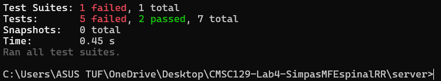
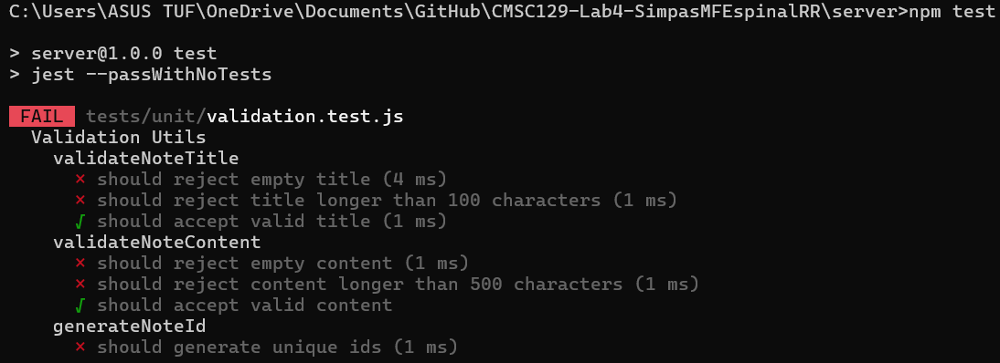
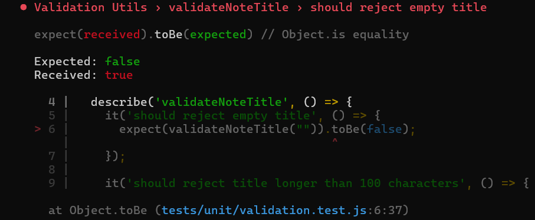
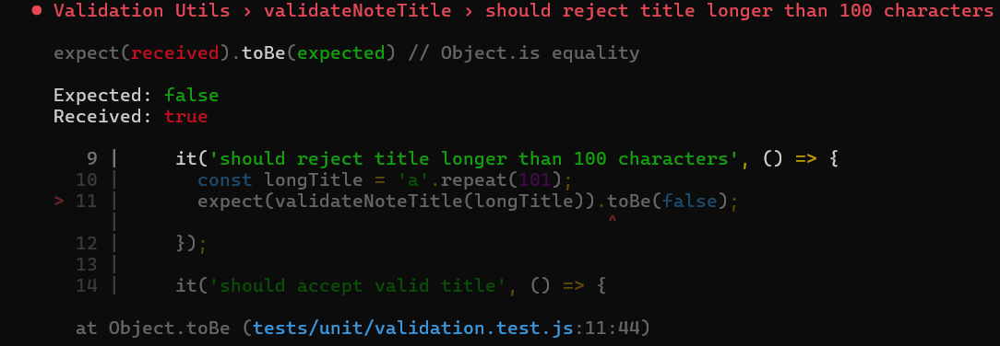
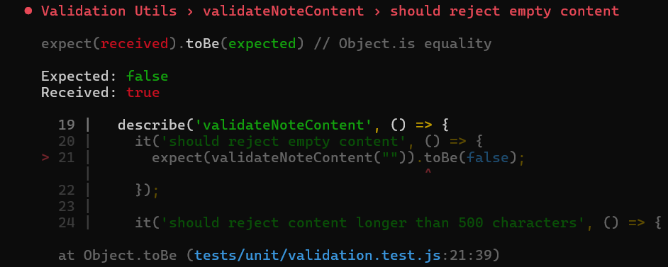
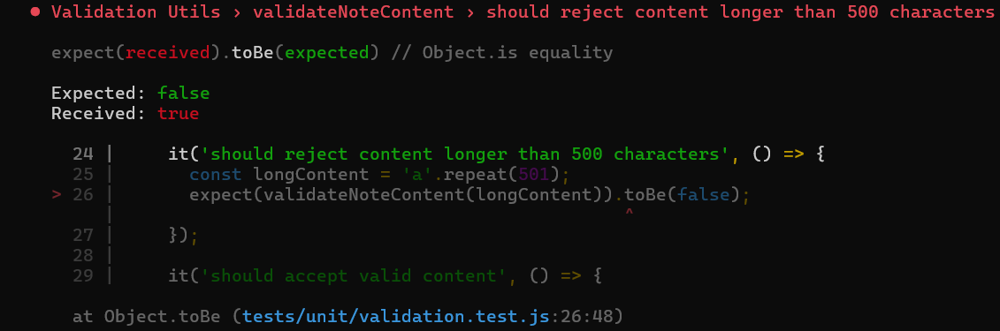
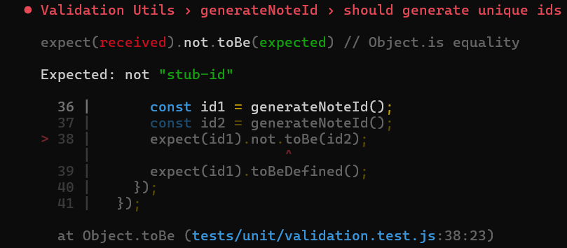

#### Commit 2
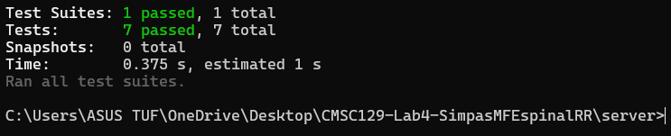
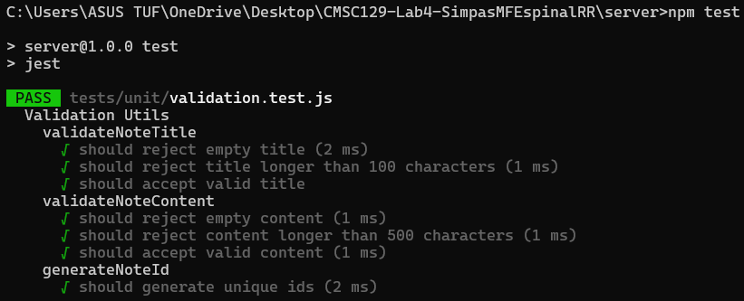

#### Commit 3
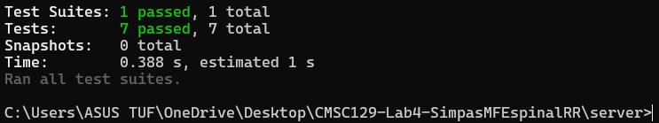
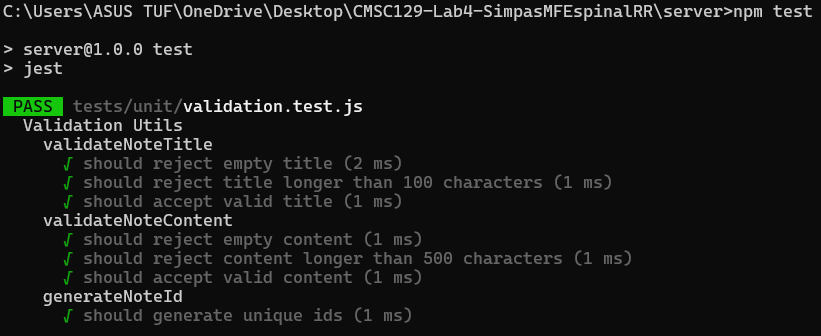

#### Commit 4
[DOCS UPDATE]